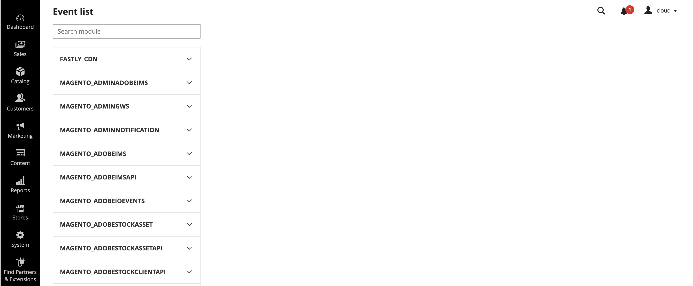

# Commerce module development

This topic describes how to enable your custom modules for Adobe I/O Events. You can also manually register observer events using the [`events:subscribe` command](./commands.md#subscribe-to-an-event).

## Find supported events

Adobe Commerce is capable of emitting thousands of different observer and plugin events, but most of them aren't good candidates for integrating with an external App Builder application. For example, Commerce emits events before and after a customer address is loaded, saved, or deleted, but the only events of consequence are those that indicate a change of status after the address is saved or deleted.

You can use the Commerce Admin or the command line to find supported events and their payloads:

*  In the Admin, select **System** > Events > **Events** to display the _Event list_ page.

   

   The left navigation contains a list of enabled modules on your system. Click on a module name to display a list of supported events. When you select an event, the main panel of the Admin displays the event's payload.

*  The `bin/magento events:list:all` command returns all the supported events in the specified module. Once you know the name of the event, you can use the `events:info` command to return its payload.

## Register events

You can programmatically register events using the following methods:

*  Create an `io_events.xml` file in your module
*  Declare them in the system `config.php` file

For each event you register, you must define which fields to transmit to your App Builder application. The payload of an event can be massive. In addition, some events include sensitive or PCI compliance data by default. The following payload is returned for the `observer.catalog_product_save_after` event:

```json
{
  "event": {
    "data": {
      "value": {
        "_edit_mode": true,
        "store_id": "0",
        "entity_id": "3",
        "attribute_set_id": "4",
        "type_id": "simple",
        "sku": "test2",
        "has_options": false,
        "required_options": false,
        "created_at": "2022-07-28 14:13:40",
        "updated_at": "2022-09-06 20:37:25",
        "row_id": "3",
        "created_in": "1",
        "updated_in": "2147483647",
        "name": "test2",
        "meta_title": "test2",
        "meta_description": "test2 ",
        "page_layout": "product-full-width",
        "options_container": "container2",
        "url_key": "test2",
        "msrp_display_actual_price_type": "0",
        "gift_message_available": "2",
        "gift_wrapping_available": "2",
        "is_returnable": "2",
        "status": "1",
        "visibility": "4",
        "tax_class_id": "2",
        "price": "123.000000",
        "meta_keyword": "test2",
        "options": [],
        "media_gallery": { "images": [], "values": [] },
        "tier_price": [],
        "tier_price_changed": 0,
        "quantity_and_stock_status": {
          "is_in_stock": "1",
          "qty": "333"
        },
        "category_ids": [ "4" ],
        "is_salable": 1,
        "stock_data": {
          "item_id": "3",
          "product_id": "3",
          "stock_id": "1",
          "qty": "333",
          "min_qty": "0",
          "use_config_min_qty": "1",
          "is_qty_decimal": "0",
          "backorders": "0",
          "use_config_backorders": "1",
          "min_sale_qty": "1",
          "use_config_min_sale_qty": "1",
          "max_sale_qty": "10000",
          "use_config_max_sale_qty": "1",
          "is_in_stock": "1",
          "notify_stock_qty": "1",
          "use_config_notify_stock_qty": "1",
          "manage_stock": "1",
          "use_config_manage_stock": "1",
          "stock_status_changed_auto": "0",
          "use_config_qty_increments": "1",
          "qty_increments": "1",
          "use_config_enable_qty_inc": "1",
          "enable_qty_increments": "0",
          "is_decimal_divided": 0,
          "website_id": "0",
          "deferred_stock_update": "0",
          "use_config_deferred_stock_update": "1",
          "type_id": "simple",
          "min_qty_allowed_in_shopping_cart": [Array]
        },
        "use_config_gift_message_available": "1",
        "use_config_gift_wrapping_available": "1",
        "current_product_id": "3",
        "affect_product_custom_options": "1",
        "current_store_id": "0",
        "product_has_weight": "1",
        "is_new": "0",
        "website_ids": { "1": "1" },
        "url_key_create_redirect": "test2",
        "ignore_links_flag": false,
        "can_save_custom_options": true,
        "save_rewrites_history": true,
        "can_save_bundle_selections": false,
        "is_custom_option_changed": true,
        "parent_id": 0,
        "special_from_date_is_formated": true,
        "custom_design_from_is_formated": true,
        "news_from_date_is_formated": true,
        "news_to_date_is_formated": true,
        "is_changed_categories": false,
        "is_changed_websites": false,
        "force_reindex_eav_required": true
      }
    }
  }
}
```

You define an array of fields to transmit in your configuration file. Specify any field within an event's `value` object to ensure it is transmitted to an application. If the field is part of a secondary object, such as `stock_data` in the above example, use the format `<object-name>.field`. For example: `stock_data.product_id`.

After you've registered at least one event, run the [events:generate:module command](./commands.md#generate-a-commerce-module-based-on-a-list-of-subscribed-events) to generate the required plugins.

### io_events.xml

Create the `<module-root>/etc/io_events.xml` file and define a list of events that should always be transmitted. Events listed in this file cannot be disabled with the [`events:unsubscribe` command](./commands.md#unsubscribe-from-a-commerce-event).

The following example registers multiple events. The `<fields>` element defines the contents of each transmitted event.

```xml
<config xmlns:xsi="http://www.w3.org/2001/XMLSchema-instance" xsi:noNamespaceSchemaLocation="urn:magento:module-commerce-events-client/etc/io_events.xsd">
    <event name="observer.catalog_product_save_after">
        <fields>
            <field name="entity_id" />
            <field name="sku" />
            <field name="is_new" />
        </fields>
    </event>
    <event name="plugin.magento.sales.api.invoice_item_repository.save">         
        <fields>
            <field name="entity_id" />
            <field name="parent_id" />
            <field name="base_price" />
            <field name="tax_amount" />
            <field name="base_row_total" />
            <field name="discount_amount" />
            <field name="qty" />
        </fields>
    </event>
    <event name="plugin.magento.catalog.model.resource_model.product.save">
        <fields>
            <field name="entity_id" />
            <field name="sku" />
            <field name="name" />
            <field name="price" />
            <field name="created_at" />
        </fields>
    </event>
</config>
```

The contents of an `observer.catalog_product_save_after` event are similar to the following:

```json
{
    "value": {
    "entity_id": "3",
    "sku": "test2",
    "is_new": "0"
  },
}
```

### config.php

You can also create an `io_events` section in the Commerce [`app/etc/config.php file`](https://experienceleague.adobe.com/docs/commerce-operations/configuration-guide/files/deployment-files.html). Events registered using this mechanism can be disabled from the command line.

For example:

```config
'io_events' => [
    'observer.catalog_product_save_after' => [
        'fields' => [
            'entity_id',
            'sku',
            'is_new',
        ],
        'enabled' => 1
    ],
    'plugin.magento.sales.api.invoice_item_repository.save' => [
        'fields' => [
            'entity_id',
            'parent_id',
            'base_price',
            'tax_amount',
            'base_row_total',
            'discount_amount',
            'qty',
        ],
        'enabled' => 1
    ],
    'plugin.magento.catalog.model.resource_model.product.save' => [
        'fields' => [
            'sku',
            'entity_id',
            'name',
            'price'
        ],
        'enabled' => 1
    ],
]
```

The payload for the `observer.catalog_product_save_after` event is the same as shown in [`io_events.xml`](#io_eventsxml).

## Configuration merging from different modules

If multiple Commerce modules register the same event, the configuration manager merges the two configurations. The transmitted event includes all the fields defined in the modules.

In the following example, the `MODULE1/etc/io_events.xml` file registers the `observer.catalog_product_save_after` event with the `entity_id` and `sku` fields.

```xml
<config xmlns:xsi="http://www.w3.org/2001/XMLSchema-instance" xsi:noNamespaceSchemaLocation="urn:magento:module-commerce-events-client/etc/io_events.xsd">
    <event name="observer.catalog_product_save_after">
        <fields>
            <field name="entity_id" />
            <field name="sku" />
        </fields>
    </event>
</config>
```

The `MODULE2/etc/io_events.xml` file registers the same event with the `entity_id` field and two others.

```xml
<config xmlns:xsi="http://www.w3.org/2001/XMLSchema-instance" xsi:noNamespaceSchemaLocation="urn:magento:module-commerce-events-client/etc/io_events.xsd">
    <event name="observer.catalog_product_save_after">
        <fields>
            <field name="entity_id" />
            <field name="quantity_and_stock_status.qty" />
            <field name="stock_data.min_qty" />
        </fields>
    </event>
</config>
```

The resulting configuration:

```xml
<config xmlns:xsi="http://www.w3.org/2001/XMLSchema-instance" xsi:noNamespaceSchemaLocation="urn:magento:module-commerce-events-client/etc/io_events.xsd">
    <event name="observer.catalog_product_save_after">
        <fields>             
            <field name="entity_id" />
            <field name="sku" />
            <field name="quantity_and_stock_status.qty" />
            <field name="stock_data.min_qty" />
        </fields>
    </event>
</config>
```
